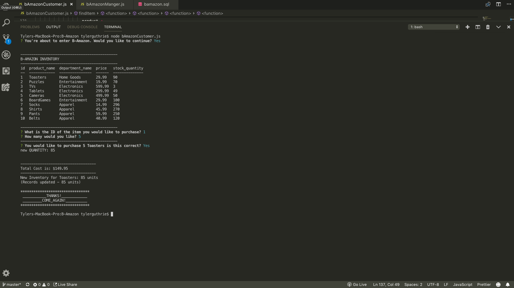

# B-Amazon
A CLI (Command Line Interface) storefront similar to Amazon.com. This app allows a customer to purchase items from the store. It also allows the manager to: view available products, view low inventory items (less than 5), add to an item's inventory, and add a new product.   

Technology Used
-----
- Javascript
- Node.js: Logic & Backend Script
- Inquirer(npm): Question Formatting
- MySQL: Database
- Console.table: Results Formatting

Customer - Purchasing an Item
-----

Manager - View Available Products
----- 

Manager - View Low Inventory Items
----- 

Manager - Add to an Item's Inventory
----- 

Manager - Add a New Product for Sale
----- 

